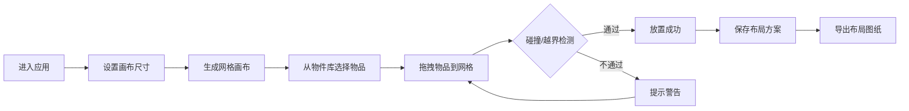

## 1. 产品概述

居家收纳格子布局规划工具是一款帮助用户可视化规划衣柜、抽屉、收纳盒等空间的在线应用。用户可以自定义空间尺寸，从预设物件库中拖拽物品到网格中，自动检测碰撞，保存多套方案并导出布局图纸。

- 核心价值：降低收纳规划试错成本，提升空间利用率
- 目标用户：居家整理爱好者、租房人群、收纳设计师

## 2. 核心功能

### 2.1 功能模块

1. **画布自定义模块**：输入长宽尺寸生成网格画布，支持单位切换
2. **收纳物件库模块**：衣物、书籍、杂物、电子产品四大类预设物品
3. **拖拽摆放模块**：拖拽物品到网格，碰撞检测与越界提示
4. **布局保存模块**：本地缓存多套收纳方案，一键切换
5. **导出图纸模块**：导出带标注的布局示意图图片
6. **移动端适配**：触屏拖拽支持，响应式布局

### 2.2 页面详情

| 页面名称 | 模块名称 | 功能描述 |
|----------|----------|----------|
| 主界面 | 画布区域 | 可自定义尺寸的网格画布，展示收纳布局 |
| 主界面 | 物件库面板 | 分类展示预设收纳物品，支持搜索筛选 |
| 主界面 | 工具栏 | 尺寸设置、保存方案、切换方案、导出图片等操作 |
| 主界面 | 属性面板 | 选中物品的尺寸、名称调整，删除操作 |

## 3. 核心流程

用户首次进入 → 自定义或使用默认画布尺寸 → 从物件库拖拽物品到网格 → 系统自动检测碰撞与越界 → 调整物品位置与数量 → 保存当前布局方案 → 导出布局图纸图片

## 4. 用户界面设计

### 4.1 设计风格

- **设计方向**：极简浅色系家居风格，温暖、治愈、整洁
- **主色调**：米白色背景 (#F8F5F0)，浅木色点缀 (#E8DDD0)
- **辅助色**：鼠尾草绿 (#A8C3A0) 用于选中状态，暖橙色 (#E8A87C) 用于警示提示
- **字体**：标题使用「思源黑体」或系统无衬线字体，正文清晰易读
- **按钮风格**：圆润胶囊形按钮，轻量阴影，悬停有微妙上浮效果
- **图标风格**：线性简洁图标，统一 2px 线条粗细

### 4.2 页面设计概览

| 页面名称 | 模块名称 | UI 元素 |
|----------|----------|---------|
| 主界面 | 画布区域 | 浅灰色网格线，物品方块带圆角与柔和阴影，选中态有绿色描边 |
| 主界面 | 物件库面板 | 卡片式物品列表，分类标签切换，悬停缩放效果 |
| 主界面 | 工具栏 | 顶部固定栏，毛玻璃效果，图标+文字按钮 |
| 主界面 | 属性面板 | 右侧滑出面板，表单式布局，实时更新 |

### 4.3 响应式

- **设计原则**：桌面端优先，移动端自适应
- **桌面端**：三栏布局（左侧物件库 + 中间画布 + 右侧属性面板）
- **平板端**：两栏布局，属性面板改为底部弹出
- **移动端**：单栏布局，物件库和属性面板均为底部/侧边滑出，支持触屏拖拽
- **触屏优化**：增大可点击区域至 44x44px，支持长按拖拽，双指缩放画布

### 4.4 动效设计

- 物品拖拽：跟随光标，半透明预览
- 放置成功：轻微弹跳动画
- 碰撞警告：红色边框闪烁 + 轻微震动
- 面板切换：平滑滑入滑出
- 方案切换：画布内容淡入淡出过渡
