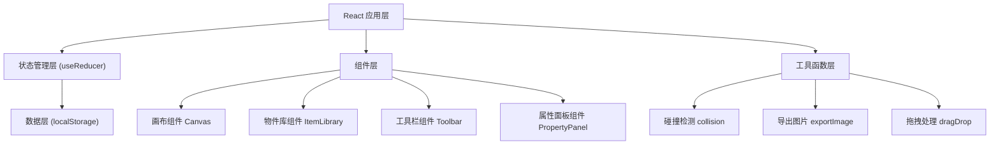

## 1. 架构设计



## 2. 技术描述

- **前端框架**：React 18 + TypeScript
- **构建工具**：Vite 5
- **样式方案**：Tailwind CSS 3
- **状态管理**：React useReducer + Context
- **本地存储**：localStorage
- **图片导出**：html2canvas
- **拖拽实现**：原生 HTML5 Drag API + 触屏事件适配
- **图标**：Lucide React

## 3. 核心数据结构

### 3.1 画布配置 (CanvasConfig)

| 字段 | 类型 | 说明 |
|------|------|------|
| width | number | 画布宽度（格子数） |
| height | number | 画布高度（格子数） |
| cellSize | number | 单个格子像素大小 |
| unit | string | 单位名称（如：cm） |

### 3.2 收纳物品 (Item)

| 字段 | 类型 | 说明 |
|------|------|------|
| id | string | 唯一标识 |
| name | string | 物品名称 |
| category | string | 分类：clothing/books/misc/electronics |
| width | number | 宽度（格子数） |
| height | number | 高度（格子数） |
| color | string | 显示颜色 |
| icon | string | 图标标识 |

### 3.3 已放置物品 (PlacedItem)

| 字段 | 类型 | 说明 |
|------|------|------|
| id | string | 实例唯一标识 |
| itemId | string | 对应物品模板 ID |
| x | number | X 坐标（格子数） |
| y | number | Y 坐标（格子数） |
| width | number | 实际宽度 |
| height | number | 实际高度 |
| name | string | 自定义名称 |
| color | string | 显示颜色 |

### 3.4 布局方案 (Layout)

| 字段 | 类型 | 说明 |
|------|------|------|
| id | string | 方案 ID |
| name | string | 方案名称 |
| canvasConfig | CanvasConfig | 画布配置 |
| items | PlacedItem[] | 已放置物品列表 |
| createdAt | number | 创建时间戳 |
| updatedAt | number | 更新时间戳 |

## 4. 核心工具函数

### 4.1 碰撞检测

```typescript
function checkCollision(item: PlacedItem, items: PlacedItem[], canvasConfig: CanvasConfig): {
  hasCollision: boolean;
  isOutOfBounds: boolean;
  collidingItems: string[];
}
```

### 4.2 网格吸附

```typescript
function snapToGrid(x: number, y: number, cellSize: number): { x: number; y: number }
```

### 4.3 图片导出

```typescript
function exportLayoutAsImage(canvasRef: React.RefObject, layout: Layout): Promise<string>
```

## 5. 状态管理

使用 useReducer 管理全局状态：

- **State**：当前画布配置、已放置物品、选中物品、当前方案 ID、方案列表
- **Actions**：
  - SET_CANVAS_CONFIG - 设置画布尺寸
  - ADD_ITEM - 添加物品
  - REMOVE_ITEM - 删除物品
  - MOVE_ITEM - 移动物品
  - UPDATE_ITEM - 更新物品属性
  - SELECT_ITEM - 选中物品
  - SAVE_LAYOUT - 保存布局
  - LOAD_LAYOUT - 加载布局
  - DELETE_LAYOUT - 删除布局

## 6. 本地存储

- **Key**: `storage-layouts`
- **存储内容**: 所有布局方案的 JSON 数组
- **触发时机**: 每次保存/删除方案时同步写入
- **初始加载**: 应用启动时从 localStorage 读取
